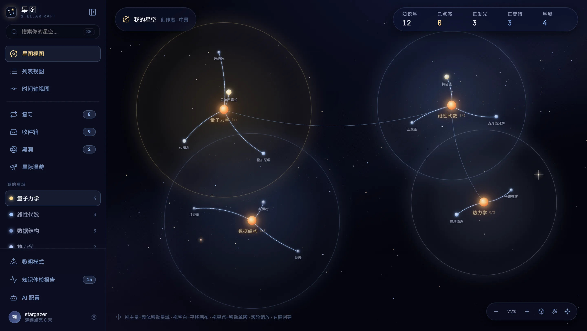
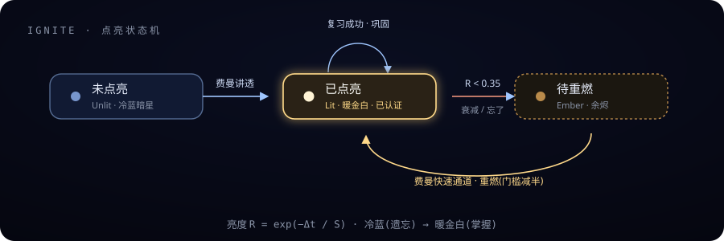
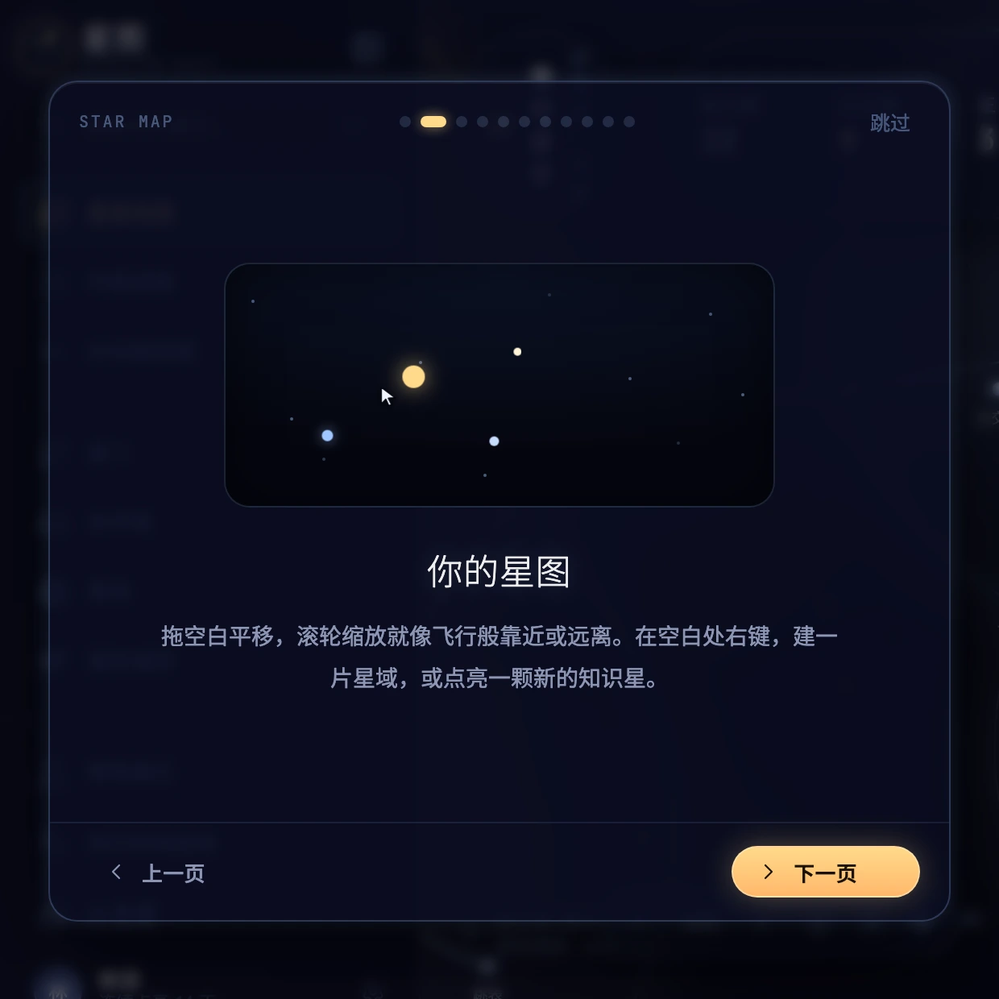
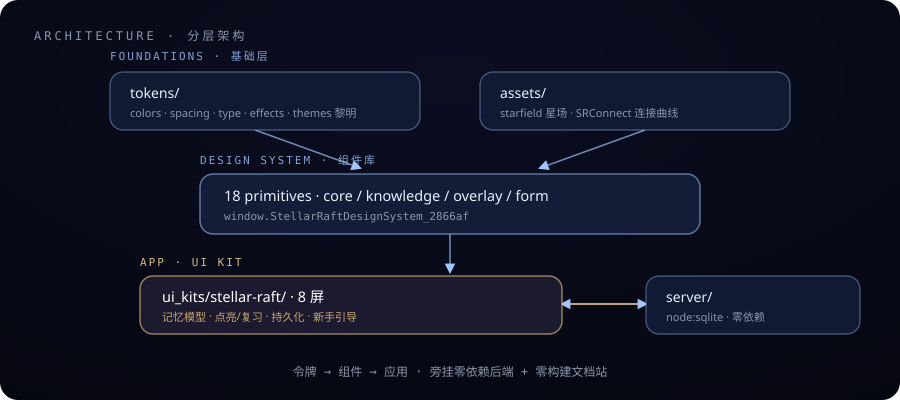

<div align="center">

# Stellar Raft · 星图

**Other apps store notes in a warehouse — Stellar Raft grows them in a living deep space of knowledge.**


English · [中文](README.md)

<br/>



</div>

---

## What this is

**Stellar Raft** is the brand and **design system** for a knowledge-notes app aimed at STEM-leaning university students.

Knowledge becomes a living deep space: every note is a star that blazes when remembered and cools, dims, and finally goes dark when neglected.

This repository is three things at once:

- **The single source of truth for the design system** — tokens + 18 component primitives + a zero-build docs site
- **A complete interactive app** — map / list / editor / review / inbox / roaming … all real and usable, across desktop / tablet / phone breakpoints
- **A zero-dependency backend** — Node's built-in `node:sqlite` only, no third-party packages

> **Core promise** — a knowledge map that both **grows and forgets**: memory made visible.

---

## Contents

| | |
| --- | --- |
| [Getting started](#getting-started) · [Tech stack](#tech-stack) · [Project structure](#project-structure) · [Scripts](#scripts) | Get it running |
| [The memory model](#the-memory-model) · [Design philosophy](#design-philosophy) | Why it works this way |
| [Features](#features) · [On phones](#on-phones) · [Admin console](#admin-console) | What it does |

---

## Getting started

**Prerequisites** — Node.js **≥ 22.13** (for the built-in `node:sqlite`).

> Why not 22.5: `node:sqlite` did land in 22.5.0, but it stayed behind the `--experimental-sqlite` flag until **22.13.0**. Claiming 22.5 means anyone on 22.5–22.12 follows the command below and gets nothing but "cannot find module node:sqlite".

```bash
npm install     # only two dev deps: Babel standalone, oxlint
npm run serve   # local backend + static hosting
```

Open **http://localhost:8756/ui_kits/stellar-raft/** to click through the full app.

### Default admin account

On its **first boot** (a freshly created database) the server seeds an admin account and prints the credentials to the console:

| | Factory value |
| --- | --- |
| Username | `admin` |
| Password | `stellar-admin` |

Signing in with it adds a **星港管理台 / Admin Console** entry at the bottom of the sidebar. These credentials are public knowledge — they are printed in this README and in the boot log — so **the first sign-in with them stops you right there** and requires changing the username *and* the password to a pair only you know (see [Factory credential handover](#factory-credential-handover)).

To make sure factory credentials never exist, set your own **before that first boot**:

```bash
SR_ADMIN_USER=captain SR_ADMIN_PASS='your own strong password' npm run serve
```

An account seeded that way is not a factory credential and is never asked to hand over.

> The admin is seeded exactly once: even if that account is later deleted it is not recreated (no ghost resurrection after a deletion). To appoint another admin on an existing database, promote any account from the console's **Travelers** section.

**Environment variables**

| Variable | Effect |
| --- | --- |
| `PORT` | Listen port (default `8756`) |
| `SR_DB` | Database location (default `server/stellar.db`; missing parent directories are created) |
| `SR_ADMIN_USER` / `SR_ADMIN_PASS` | Admin credentials seeded on first boot (setting them means no factory pair, and no handover prompt) |
| `SR_HOST` | Bind address (default `127.0.0.1`, this machine only; `0.0.0.0` lets phones/tablets on the same network open it) |
| `SR_TRUST_PROXY=1` | Trust the first `X-Forwarded-For` hop as the source IP (**required behind a reverse proxy**) |
| `SR_GUEST_PER_IP` | Initial guests-per-IP limit (default `1`, `0` = unlimited; the console setting wins afterwards) |
| `SR_GUEST_GATES=off` | Turn all four feature gates off initially (on by default) |

> Point `SR_DB` at a data volume in production and upgrades never have to move data; locally, give a second instance a throwaway database and it won't touch the one you're using:
>
> ```bash
> PORT=8757 SR_DB=/tmp/probe/stellar.db npm run serve
> ```

### Opening it from a phone or tablet

The breakpoints and gestures are written for touch screens, yet the server binds `127.0.0.1` by default — a phone cannot reach it, and that layout can only be seen by shrinking a desktop window. Let it listen on the network:

```bash
SR_HOST=0.0.0.0 npm run serve
```

The boot log prints the address other devices should use, so nobody has to go read `ifconfig`:

```text
[stellar-raft] http://localhost:8756/ui_kits/stellar-raft/  (static + API - database server/stellar.db)
[stellar-raft] Devices on the same network: http://192.168.0.158:8756/ui_kits/stellar-raft/
[stellar-raft] Note: a http:// LAN address is not a "secure context" ...
```

**Two things to know**

- **It really does open the door** — anyone on the network can reach it, and Stellar Raft is open to unregistered visitors by design (one guest per IP). Fine at home or in a dorm; not on cafe Wi-Fi. The default is `127.0.0.1` precisely so this never happens quietly.
- **`http://` with an IP is not a "secure context"** — browsers delete `navigator.clipboard` and `crypto.randomUUID` there outright. Each has a fallback: copying goes through the legacy `execCommand` path and **reports truthfully whether it worked** (it used to claim "copied" either way), and anonymous tokens fall back to `Math.random`. Put an HTTPS reverse proxy in front for the full experience.

**On a phone this is a different layout, not a shrunken one**

| On a phone | How it is handled |
| --- | --- |
| A 260px permanent sidebar would eat 70% of the width | The four most-visited places drop to a bottom tab bar (within thumb reach); the full sidebar moves into a left drawer — the drawer holds the very same sidebar, not a second navigation |
| The six-column note table does not fit | Each row becomes a card: title, then the memory bar, then domain / next review / links. This switches on "can the grid still hold" (≤1180px), not on "is this a phone" — iPad portrait and phone landscape both live in that band |
| The editor's knowledge rail has nowhere to go | It moves into a bottom sheet behind one header button. Outline / linked stars / backlinks / memory / locate-on-map / AI assistant — all six, sharing one copy of the rail with the desktop |
| A star is only 4–12px on screen | Touch devices get a transparent hit area computed as `44 / zoom`, so it stays 44 screen px at any zoom level |
| Inputs smaller than 16px | Raised to 16px on touch — not cosmetic: iOS zooms the whole page to reach 16px and never zooms back |
| Notch and home indicator | `viewport-fit=cover` fills the screen, then `env(safe-area-inset-*)` gives the space back to the top bar, tab bar and editor status bar individually |

**Other platform differences, levelled out**

| Difference | How it is handled |
| --- | --- |
| iOS Safari <= 17 does not accept unprefixed `backdrop-filter` | Every glass surface carries the `-webkit-` prefix. Without it this is not "a missing effect" — every panel becomes a flat translucent block, a different face entirely. `responsive.test.js` guards it |
| Windows `core.autocrlf` rewrites LF to CRLF | `.gitattributes` pins `eol=lf` repo-wide. Artifact hashes are taken over **file bytes**, so a line-ending flip makes `npm run build:check` report wholesale drift against source that never changed |
| macOS says Cmd, Windows/Linux say Ctrl | `SRKeys` picks the wording per platform; key handling has always accepted `metaKey \|\| ctrlKey` |
| Find-highlighting uses the CSS Custom Highlight API | Where it is unsupported this degrades to "jump and select" — the feature still works |

---

### What this server hands out

The process's document root is the whole repository — database, `.git`, `node_modules`, tests and every source file live in there. Static hosting runs on an **allowlist**; only these leave the machine:

```text
ui_kits/  components/  tokens/  assets/  docs/  guidelines/
styles.css  _ds_bundle.js  _ds_manifest.json
```

Everything else is 404 — not 403, because "is there something here" is a question that need not be answered. Dot-prefixed paths (`.git` / `.env` / `.github`) are refused wholesale, and extensions are an allowlist too: a type missing from the MIME table never ships, so a stray `.db` inside a public directory still cannot be fetched.

> Why this strict: the process listens on `127.0.0.1` only, so it looks unreachable. But the recommended deployment puts it behind nginx / Caddy, and a reverse proxy forwards `/server/stellar.db` verbatim — that is the entire database: password hashes, everyone's note bodies, session tokens, share codes. `tests/static.test.js` guards both sides of this line: everything that should ship still ships, nothing that shouldn't does.

### Security lines that hold

Each one has a test watching it; break it and CI goes red.

| The line | How it holds | Guarded by |
| --- | --- | --- |
| One request cannot kill the process | The whole pipeline sits in a try: `GET /%ZZ` made `decodeURIComponent` throw `URIError`, which inside an http callback is an uncaughtException — the process exited. An unauthenticated GET should not carry that weight | `security.test.js` |
| Passwords survive grinding | scrypt (16-byte random salt, 64-byte output, `timingSafeEqual`); login throttled on two tallies (50 per IP, 6 per account, 15-minute window) | `throttle.test.js` |
| Timing does not name accounts | A miss runs the same heavy hash — otherwise "a few ms vs tens of ms" tells anyone which accounts exist on this server | `security.test.js` |
| Sign-ins expire | 90 days untouched and the session is invalidated and deleted; a dead token says "sign in again" instead of quietly becoming a new guest | `resilience.test.js` |
| Tokens stay out of URLs | Only the `Authorization` header counts; `?token=` is open to exactly two entry points that cannot set headers (sendBeacon, backup download) — a token in a URL travels through Referer, proxy logs and browser history | `security.test.js` |
| Errors reveal nothing | Every 500 body is the same sentence; sqlite schema and absolute paths stay in the server log | `security.test.js` |
| Note bodies never leave the database | The visitor view is rebuilt field by field server-side (names, structure, outline only) rather than "delete a few fields and ship it" | `server.test.js` |
| Rich text carries no charge | Allowlist sanitizer (tags / attributes / style / schemes); 30 attack samples judged by **the scheme a browser actually resolves**, not by whether a word appears in the output | `sanitize.test.js` |
| The runtime has a known origin | All five CDN scripts are version-pinned and carry `integrity` + `crossorigin` — poisoned or rewritten bytes simply do not execute | `security.test.js` |
| Malformed input earns only a 4xx | A body of `null`, an array, every type wrong — all 4xx; ids become integers before they reach SQL | `server.test.js` |
| A bad snapshot cannot take anyone down | Every member of every array in a snapshot is validated too (nulls, strings, wrongly-typed stars/constellations/connections) — one bad star cannot hand visitors a 500, let alone paralyse the admin console | `server.test.js` · `admin.test.js` |
| Imports carry no bombs | Vault imports are bounded: zip entry count capped, total decompressed size capped, 64MB per picked file — a zip bomb cannot blow up the tab | `vault.test.js` |
| Only the owner lifts a veil | After "hide from them", removing the friendship and redeeming the same code again does not wash the flag away — the unblock belongs to the owner alone | `server.test.js` |

---

## The memory model

Each star holds `sr = { S stability, last review, lit timestamp, ember timestamp }`.

**Retrievability** `R = exp(−Δt / S)` is used directly as brightness — recomputed on every open, every view switch, and a per-minute heartbeat, against real elapsed time. Skip your reviews and stars genuinely go dark.

```
Brightness R = exp(−Δt / S)     cold blue (forgetting) → warm gold-white (mastered)
On success   S ×= growth + (1−R)·0.6
On failure   S ×= 0.45
Stability cap   365 days once lit · 60 days if never lit
```

**Ignition** is a certification axis independent of brightness — a star is truly lit only after you explain it in Feynman mode. Lit stars decay too, extinguishing into a re-kindle "ember" state below threshold.

<div align="center">

</div>

**Four review strategies** genuinely drive the due queue and desktop notifications: forgetting-curve cooling · the classic 1·3·7·15-day ladder · daily · off.

---

## Design philosophy

Stellar Raft is a *work of art*, not another white-background office notebook. Four aesthetic laws hold throughout:

1. **Every visual element carries information, never mere decoration** — brightness = memory strength · size = importance · distance = relatedness · color temperature = age. Beauty must be *readable*.
2. **Less is more** — 3–4 hues total; no rainbow, no cartoon, no skeuomorphic kitsch.
3. **Dark stage first** — bold black negative space, low density, room to breathe. An empty account is almost entirely black; **knowledge is the only light introduced**.
4. **The editor is professional-first, beautiful-second** — but beauty never drops out.

**Palette**

| Role | Value | Meaning |
| --- | --- | --- |
| Star-blue | `#9fc6ff` | Structure, links, default icons |
| Gold | `#ffd98a → #ffb86b` | Reward, ignition, mastery |
| Deep space | `#03040c → #05060f` | The backdrop field |

---

## Features

### Knowledge itself

- **A star map that forgets** — memory strength decays against real time and drives each star's brightness and color temperature.
- **Ignite by teaching** — explain a star in Feynman mode and it truly lights up (a golden ignition moment).
- **Spaced-repetition review** — due cards, three-way self-grading (forgot / fuzzy / got it), closing the loop that keeps stars alive.
- **Window of time** — the checkup page previews which stars will extinguish or fall due within 7 days, one click queues them; forgetting becomes a **forewarning**, not a post-mortem. A 16-week activity heatmap and streak derive live from the timeline.

### Writing and reading

- **The full set of screens** — star map · aerial view · 3D galaxy (Three.js) · Feynman drawer · list management · timeline · review session · inbox · black-hole trash · star roaming · knowledge checkup · pro block editor.
- **Pro block editor** — headings / todos / lists / quote / code / LaTeX / tables / images, live markdown conversion, ⌘F find-and-replace, backlinks and outline, app-level undo/redo (typing merges per burst, sealed at every block switch). Type `[[` to summon the star picker and insert a star link; select text and paste a URL to make it a link; a screenshot in the clipboard pastes straight into an image block; star links in the body navigate on click, external links open in a new tab.
- **Knowledge flows both ways** — ⌘K full-text search reaches into note bodies (highlighted snippets); export your galaxy as an Obsidian-style Markdown vault (zip, zero-dependency packaging), and **import one back** — a .zip or a batch of .md files grows into a galaxy (folders→constellations, frontmatter→props, `[[wikilinks]]`→connections, merged incrementally). Import/export round-trips with real GFM, aligned with GitHub · Typora · Obsidian — both directions are fuzz-tested property-style (thousands of random block documents plus adversarial inputs): round-trips lose nothing, and bracket-dense hostile text cannot freeze the page (the link regex is hardened against backtracking). Images up to 100KB travel inside the vault as inline dataURLs and come back intact; in-body star links are re-pointed via the old id stored in frontmatter, so they still work after re-import; favorites ride frontmatter too. **The trash is not part of the Markdown vault** (things in the black hole are meant to vanish) — to back up trash, timeline and AI config as well, use the whole-galaxy JSON export in Settings.
- **Images know their place** — Stellar Raft stores one galaxy as a single snapshot, so an image inlined in a note travels as a data URL with *every* save. Large images are therefore resized before they enter a note: small ones are kept byte-for-byte, big ones are scaled to a 1600px long edge and stepped down in quality (webp first, so transparency survives), GIF/SVG are size-checked rather than re-encoded, and anything still too large is refused out loud. Without that step one phone photo pushes the whole galaxy past the server's 8MB body limit and the localStorage quota — every save fails from then on, and all the user sees is "server unreachable".
- **Press `?`** for a full shortcut cheatsheet, anywhere.

### Social and AI

- **Interstellar roaming & knowledge resonance** — visit friends' galaxies via share ciphers (server-side cropping; **note bodies never leave the owner's database**); while visiting, the stars you both own — or both ignited — light up as resonance; leave a one-line star-note, gift stars, collect them; owners see visitor footprints and mail.
- **Real AI integration** — plug in OpenAI / Anthropic / any OpenAI-compatible gateway (one-api, Ollama…): the Feynman "AI student" asks real follow-up questions, and the editor can summarize, suggest tags, and propose cross-constellation links. Falls back gracefully to a local rule-based student when unconfigured.

### Accounts and engineering

- **Accounts & multi-device** — username/email login (scrypt + sessions); registering folds your anonymous galaxy **into the account in place**, losing nothing; every local trace (API keys included) is wiped on account switch.
- **Sync compares causality, not clocks** — optimistic locking by version. The local mirror records which server version its content is based on and whether that content was ever confirmed: if nobody wrote elsewhere since, pending offline edits win and are pushed up; if another device wrote, the server wins. Whichever device's system clock runs fast no longer decides anything. A 409 no longer pushes the just-converged version straight back (no conflict amplification), and an in-flight save no longer collides with itself.
- **Sessions expire** — a login untouched for 90 days is invalidated the next time it is used and deleted from the table (previously this was only a button in the console that nobody ever pressed, so a token leaked two years ago still worked). A dead session token is no longer turned into a fresh anonymous guest — that left force-signed-out people staring at a brand-new empty starfield while consuming a guest slot; now the server says "this device's sign-in is no longer valid" and the app offers a sign-in button.
- **Crashes speak plainly** — one error boundary around the whole app and one around each view. The price of a zero-build app is that a single thrown component unmounts the entire tree; now you get a card instead — what happened, that your galaxy is safe, and how to get back (return to the map / reload / copy diagnostics) — rather than a screen of unexplained black.
- **Factory credential handover** — the factory admin's first sign-in is stopped by an undismissable card: username and password change together, and you must tick "I have written these down" before it accepts them. The handover also revokes every session on that account.
- **Login throttling** — the password is the only door once you deploy publicly. The server keeps two tallies per login attempt (source IP and account identifier): 6 consecutive failures on one account, or 50 failures from one IP within 15 minutes, and further attempts pause (429 plus how long to wait). It pauses *retrying*, not the account — the window rolls off on its own, and a successful login clears both tallies.
- **Onboarding guide** — an 11-page carousel on first run plus a spotlight walkthrough, re-openable from Settings anytime.
- **Zero-build · zero-dependency** — JSX compiled in the browser by Babel; the backend uses only Node's built-in `node:sqlite`.

<div align="center">

<br/>
<sub>The onboarding guide</sub>
</div>

---

## On phones

The kit was drawn for 1440×900. One set of breakpoints now runs through the whole app — phones get a different **layout and gesture set**, not a stripped-down build.

| Breakpoint | Width | Layout |
| --- | --- | --- |
| `phone` | ≤ 720px | Sidebar folds into a drawer · bottom tab bar (map/list/review/inbox/more) · top bar · single column · full-bleed overlays |
| `tablet` | ≤ 1024px | Collapsible sidebar · the editor's right-hand knowledge rail steps aside |
| `desktop` | > 1024px | The original desktop layout, unchanged |

**Gestures** — the star map moved wholesale from mouse events to pointer events, which is what makes touch actually work:

| Action | Phone | Desktop |
| --- | --- | --- |
| Pan the canvas | Drag empty space | Drag empty space |
| Zoom | Pinch | Wheel |
| New constellation / star | Long-press 520ms | Right-click |
| Move a star / whole constellation | Drag the node / anchor star | Same |
| Inspect a star | Tap (card docks to the bottom, never covering the map) | Click (card follows the star) |

**Deliberate trade-offs**

- **Pinch-to-zoom is never disabled** — `user-scalable=no` crosses an accessibility line. The map's own zoom is a two-finger gesture and doesn't conflict with the browser's.
- **Safe areas live in four `--sr-safe-*` variables**, so no component writes its own `env()`. The top bar absorbs the notch, the tab bar absorbs the home indicator, and views receive a clean rectangle.
- **`100vh` gets eaten by the address bar** — prefer `100dvh`, fall back to a measured `--sr-vh` on older browsers.
- **Breakpoints have exactly one source of truth** (`SRScreen` in `responsive.js`); components all call `SRKit.useScreen()`. A test watches specifically for anyone sneaking in their own `matchMedia`.
- **No tab bar in the editor** — it only gets in the way once the keyboard is up; the way back lives in the editor's own header.

---

## Admin console

Sign in as an admin and a **星港管理台 / Admin Console** entry appears at the bottom of the sidebar — visible to admins only. Admins are **exactly like everyone else** inside the app; the console is simply an extra layer.

### Factory credential handover

The moment the factory admin signs in with `admin` / `stellar-admin`, an **undismissable handover card** covers the whole app:

- **Username and password change together** — changing only the password is not enough. The factory username is public too; keeping it hands over the door number as well, sparing an attacker exactly the "figure out who" step. Both are validated server-side in one endpoint: the factory username (case-insensitive), the factory password, and a password identical to the username are all rejected, and the admin password floor is **8 characters** (6 for ordinary accounts).
- **You must tick "I have written these credentials down" yourself** — the submit button stays disabled until you do. Stellar Raft stores no recovery email and sends no reset mail; forget this pair and the only way back is editing that row in the database on the server. The card also offers a "copy these credentials" button for your password manager.
- **The handover revokes every session** — including the one you are holding. Factory credentials are public, so someone else may already be signed in with them; the server clears this account's session table outright and issues exactly one new key to your device. Everything else lands back on the login page.
- **The only way out is "sign out"** — someone who signed in by mistake should not be trapped, but there is no way *around* it either: no Esc, no backdrop click, no close button.

Once the handover is done both factory values are dead, the red warning at the top of the console comes off, and the audit log records one `admin.handover`. The door opens once — calling the endpoint again on a handed-over station returns 409.

> The card stops **people**, not requests: a front-end modal cannot stop someone editing the JS. Its real job is to turn "change the factory credentials" from advice in a README into something you cannot walk past. The server-side guarantees are separate: every `/api/admin/*` route is independently guarded, logins are throttled, and the handover endpoint only accepts an admin proven by a real session.

**Eight sections**

| Section | What it does |
| --- | --- |
| **Overview** | Account composition · total and lit stars · 14-day arrival/registration/login trends · guests and source IPs · shares and mail · process and disk · site toggles, with runtime figures refreshing every 10s |
| **Travelers** | Search (name/username/email/IP), filter, sort, paginate; expand any row for that person's constellations, memory strength, source IP, last login, shares, visitors and sessions; ban, grant/revoke admin, reset password, edit profile, force sign-out, cascade delete |
| **Guests** | Anonymous guests grouped by source IP · per-IP limit · individual toggles for the four feature gates · one-click purge of empty accounts (never touching one that has saved anything) |
| **Shares** | Who has opened a galaxy to the outside, how far, and how many visitors; force-close (the cipher survives, so the owner can reopen) |
| **Sessions** | Every device that has signed in; tokens surface as a fingerprint only — the full token never leaves the database |
| **Broadcast** | Site-wide announcements (three tones + live preview, shown once per user) · registration switch · maintenance mode |
| **System** | Database size breakdown · one-click backup download (full `.db`) · WAL checkpoint · VACUUM · expired-session cleanup |

**Restoring from a backup**: the backup is the whole database file (WAL is checkpointed before download). Restore = stop the server → replace `server/stellar.db` (or wherever `SR_DB` points) with the backup file → start again. Remove any leftover `stellar.db-wal` / `stellar.db-shm` siblings so the restored file starts clean.
| **Audit log** | Every ban, deletion, password change and site change (last 2000 entries) |

Every figure is computed server-side from the database on request — never estimated, never sampled.

What *is* cached is the **shape** of a parsed snapshot: the handful of fields per star that feed the math, keyed by the snapshot's version so that any save invalidates it on the spot. Time-dependent values — brightness, lit, ember — are still computed per request: the same galaxy seen ten minutes later should be a little dimmer, and that cannot be frozen at the moment of the last save.

> This is measured, not fussed over. At 300 accounts and 46MB of snapshots, the overview and the traveler list each took **273ms** — and the overview polls every 10 seconds. Node is single-threaded, so for those 273ms every other user's request is queued behind it. They are now **6ms** and **1ms**. Three things went away: re-`JSON.parse`-ing every snapshot on every request; touching the table pages that hold the note bodies at all (the metadata query now rides a covering index — `LENGTH(data)` alone cost 37ms, since it must scan all 46MB to count characters); and computing galaxy figures for every account when only 20 rows ship.

**Hard rules** — admins cannot ban or delete themselves; the last admin cannot be demoted; to ban or delete another admin you must revoke their admin status first; deletion requires retyping the target's username exactly; a ban takes effect immediately, leaving the banned user only a sign-out button.

> Every `/api/admin/*` route is guarded server-side, so flipping a client-side boolean to `true` gets you nothing.

### Guests and feature gates

**One guest per IP** — a single unregistered anonymous account is allowed per source address. The second visitor is stopped and invited to sign in or register; registering frees the slot immediately. The limit is adjustable in the console's **Guests** section (`0` = unlimited).

> **Read this if you use a reverse proxy** — Stellar Raft judges origin by the direct socket address. Behind nginx / Caddy every request looks like `127.0.0.1`: the guest limit would lock the whole server to one guest, and login throttling would tally everyone's failed attempts into one bucket. Start with `SR_TRUST_PROXY=1` to read the first `X-Forwarded-For` hop instead — **only when your own proxy really sits in front**, since that header can be forged.

**Four capabilities require an account** (all on by default, individually switchable)

| Gate | Enforced at | Why |
| --- | --- | --- |
| Note editing | Client entry point | Notes are things you come back to; they deserve an account you can take with you |
| Markdown vault import/export | Client entry point | Bulk movement of an entire galaxy |
| Galaxy sharing | **Server-side** | Once a cipher is out, people can find you through it — there should be an owner first |
| Interstellar roaming | **Server-side** | Visiting leaves footprints in someone's galaxy and lets them write back |

A guest who reaches a gated feature never meets a broken button — they get an explanation card and the line "registering folds your current galaxy into the account in place, losing nothing", with the sign-in page one tap away.

---

## Architecture

Layered bottom-up: design tokens → component library → app UI kit, with a zero-dependency backend and a zero-build docs site alongside.

<div align="center">

</div>

---

## Tech stack

| Layer | Technology |
| --- | --- |
| UI | React 18 (compiled in-browser by `@babel/standalone` · zero build) |
| 3D | Three.js (the Galaxy3D view) |
| Icons | Lucide (line icons · no emoji) |
| Styling | Native CSS design tokens · glassmorphism · dual `data-theme` themes |
| Memory | FSRS-lite (`R = exp(−Δt/S)`) |
| Backend | Node ≥ 22.13 built-in `node:sqlite` (zero third-party deps) |
| Tests | `node --test` (30 suites, 366 tests) · oxlint |

---

## Project structure

```text
stellar-raft/
├─ styles.css              # the only entry consumers import (imports only)
├─ tokens/                 # design tokens: colors · spacing · typography · effects · themes (Dawn)
├─ assets/                 # <sr-starfield> web component + SRConnect link curves
├─ components/             # 18 reusable primitives · core / knowledge / overlay / form
├─ ui_kits/stellar-raft/   # the interactive app (full set of views + console · 3 breakpoints · memory model)
├─ server/                 # zero-dependency backend (node:sqlite)
│   ├─ server.js           #   request pipeline: identity → ban/maintenance/gates → dispatch
│   ├─ config.js           #   port, paths, database location (env vars only)
│   ├─ db.js               #   schema, migrations, every prepared statement
│   ├─ core.js             #   shared: replies · identity · site settings · audit · decay · delivery
│   ├─ seed.js             #   first-boot seeds: demo friend and default admin
│   └─ routes/admin.js     #   admin console (/api/admin/*, guard runs first)
├─ docs/                   # zero-build static docs site + screenshots + diagrams
├─ guidelines/             # 15 foundation spec cards (color / type / spacing / icons / brand)
├─ scripts/                # build · lint (artifacts are generated — never hand-edit _ds_bundle.js)
└─ tests/                  # node --test: 30 suites (server / auth / admin / responsive / compile / tokens …)
```

**Design system** — 18 primitives on the `window.StellarRaftDesignSystem_2866af` namespace:

- `core/` — Icon · IconButton · Button · GlassPanel · Badge · Tag · Input
- `knowledge/` — MemoryBar (+ memoryColor) · StarNode · ConstellationItem
- `overlay/` — Modal · Toast (+ imperative `toast()`) · Tooltip · ContextMenu
- `form/` — Select · Switch · Checkbox · Tabs

---

## Scripts

| Command | What it does |
| --- | --- |
| `npm run serve` | Start the local backend + static hosting (`server/server.js`) |
| `npm test` | Run `node --test` — 30 suites, 366 tests |
| `npm run build` | Rebuild `_ds_bundle.js` + `_ds_manifest.json` from source |
| `npm run build:check` | Detect drift between artifacts and source (for CI) |
| `npm run lint` | Run oxlint against the derived rule config (full `correctness` category + `no-undef`, across server / ui_kits / components / tests / docs) |

---

## License

**MIT License** — see [LICENSE](LICENSE) at the root. Free to use, modify and redistribute (commercially too); just keep the copyright notice.

<div align="center">
<br/>
<sub>Stellar Raft · 星图 — Memory, made to shine.</sub>
</div>
