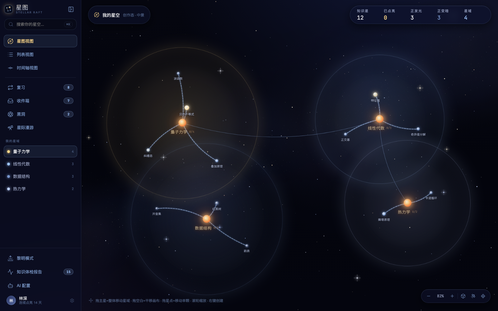

<div align="center">

# 星图 · Stellar Raft

**别人的笔记是仓库,星图是一片活着的「知识深空」。**
*Other apps store notes in a warehouse — Stellar Raft grows them in a living deep space of knowledge, where knowledge is the only light.*


<br/>



</div>

---

## 目录 · Table of Contents

- [简介 · Overview](#简介--overview)
- [核心特性 · Features](#核心特性--features)
- [设计哲学 · Design Philosophy](#设计哲学--design-philosophy)
- [记忆模型 · The Memory Model](#记忆模型--the-memory-model)
- [架构 · Architecture](#架构--architecture)
- [技术栈 · Tech Stack](#技术栈--tech-stack)
- [快速开始 · Getting Started](#快速开始--getting-started)
- [项目结构 · Project Structure](#项目结构--project-structure)
- [脚本 · Scripts](#脚本--scripts)
- [许可 · License](#许可--license)

---

## 简介 · Overview

**中文** — **星图 Stellar Raft** 是一款面向大学生(尤其理工科)的知识笔记应用的**品牌与设计系统**。它把知识可视化成一片会呼吸的深空星图:每则笔记是一颗星,记得越牢越亮,久不回望便冷却、变暗,直至熄灭。本仓库既是这套设计系统的**唯一真源**(设计令牌 + 组件库 + 文档站),也包含一个覆盖全部 8 个高保真界面的**可交互桌面端 UI Kit**,以及一个**零依赖的本地后端**。

**English** — **Stellar Raft** is the brand and **design system** for a knowledge-notes app aimed at STEM-leaning university students. Knowledge becomes a living deep-space star map: every note is a star that blazes when remembered and cools, dims, and finally goes dark when neglected. This repository is the **single source of truth** for the system (design tokens + component library + docs site), and ships an **interactive desktop UI kit** recreating all 8 hi-fi screens plus a **zero-dependency local backend**.

> 核心承诺 · Core promise — 一张**既生长也遗忘**的知识地图:让记忆变得可见。
> A knowledge map that both **grows and forgets** — memory made visible.

---

## 核心特性 · Features

**中文**

- **会遗忘的知识星图** — 记忆强度 `R = exp(−Δt / S)` 按真实时间衰减,直接驱动每颗星的亮度与色温(冷蓝=正在遗忘 → 暖金白=已掌握)。
- **费曼内化点亮** — 一颗星要在费曼模式里被「讲透」才真正**点亮**(金色高潮瞬间);点亮的星也会衰减,低于阈值熄灭为「待重燃」余烬态。
- **间隔重复复习** — 到期卡片三档自评(忘了 / 模糊 / 记得),闭环驱动稳定度增长,让星不再悄悄熄灭。
- **8 个高保真界面** — 星图主界面 · 亮度鸟瞰热图 · 三维星系(Three.js)· 近景语义缩放 · 费曼右抽屉 · 侧边栏 · 列表管理 · 专业块编辑器。
- **专业块编辑器** — H1–H3 / 待办 / 列表 / 引用 / 代码 / LaTeX / 表格 / 图片,markdown 即时转换、⌘F 查找替换、反向链接与大纲;导入导出与真实 GFM 完全互逆(提示框/折叠块/表格转义/frontmatter 对齐 GitHub · Typora · Obsidian),跨块复制即得合法 Markdown。
- **星际漫游与知识共鸣** — 星语密文造访好友星系(服务端裁剪,笔记正文永不出库);造访时自动高亮你们**共同拥有、甚至都点亮过**的知识(共鸣),可留一句星语、赠星、收纳;主人可见访客足迹与来信。
- **真实 AI 接入** — 配置 OpenAI / Anthropic / 自定义网关(one-api、Ollama 等)后,费曼「AI 学生」由所配模型真实追问(性格/严格度进提示词),编辑器可生成摘要、推荐标签、建议跨星域连接;未配置时优雅回退本地规则学生。
- **复习策略可选** — 随星变暗(遗忘曲线)/ 1·3·7·15 天间隔阶梯 / 每日固定 / 不提醒,四档策略真实驱动到期队列与桌面通知,星域整体变暗另有提醒;复习卡上可让 AI「考一考」出回忆题(自评永远归你)。
- **时间之窗 · 观星热力图** — 体检页预演未来 7 天哪些星将熄灭/到期,一键排入复习——把遗忘从事后发现变成事前预警;16 周观星热力图与连续天数由时间线实时派生。
- **知识带得走** — ⌘K 全文搜索直达笔记正文(片段高亮);一键把整片星空导出为 Obsidian 风格 Markdown 仓库(zip):每星一档、星域分夹、[[wikilink]] 关联、README 索引,零依赖打包。
- **新手引导** — 首次打开自动弹出的 11 页导览册 + 末页聚光实地导览,随时可在设置里回看。
- **账号与多设备** — 用户名/邮箱登录(scrypt + sessions),注册把当前匿名星空原地收进账号,换台设备也能回来;偏好与 AI 配置随快照同步,切换账号时本机密钥等痕迹全部清理。
- **零构建 · 零依赖** — 浏览器内 Babel 编译 JSX;后端仅用 Node 内置 `node:sqlite`,不装任何三方包。

**English**

- **A star map that forgets** — retrievability `R = exp(−Δt / S)` decays against real time and drives each star's brightness and color temperature (cold blue = forgetting → warm gold-white = mastered).
- **Ignite by teaching** — a star is truly **lit** only after you explain it in Feynman mode (a golden ignition moment); lit stars decay too, extinguishing into a re-kindle "ember" state below threshold.
- **Spaced-repetition review** — due cards, three-way self-grading (forgot / fuzzy / got it), closing the loop that keeps stars alive.
- **8 hi-fi screens** — star map · aerial heat map · 3D galaxy (Three.js) · semantic-zoom card · Feynman drawer · sidebar · list management · pro block editor.
- **Pro block editor** — headings / todos / lists / quote / code / LaTeX / tables / images, live markdown conversion, ⌘F find-and-replace, backlinks and outline; import/export round-trips with real GFM (alerts, collapsible blocks, table escaping, frontmatter — GitHub · Typora · Obsidian aligned), and multi-block copy yields valid Markdown.
- **Interstellar roaming & knowledge resonance** — visit friends' galaxies via share ciphers (server-side cropping; note bodies never leave the owner's database); while visiting, the stars you **both own — or both ignited** — light up as "resonance"; leave a one-line star-note, gift stars, collect them; owners see visitor footprints and mail.
- **Real AI integration** — plug in OpenAI / Anthropic / any OpenAI-compatible gateway (one-api, Ollama…): the Feynman "AI student" asks real follow-up questions (persona & strictness shape the prompt), and the editor can summarize, suggest tags, and propose cross-constellation links; gracefully falls back to the local rule-based student when unconfigured.
- **Selectable review strategies** — forgetting-curve cooling / classic 1·3·7·15-day ladder / daily / off, each genuinely driving the due queue and desktop notifications, plus a constellation-dimming nudge; review cards can ask the AI to quiz you (grading always stays yours).
- **Window of time · stargazing heatmap** — the checkup page previews which stars will extinguish or fall due within 7 days, one click queues them — forgetting becomes a forewarning, not a post-mortem; a 16-week activity heatmap and streak derive live from the timeline.
- **Knowledge you can take away** — ⌘K full-text search reaches into note bodies (highlighted snippets); export your whole galaxy as an Obsidian-style Markdown vault (zip): one file per star, folders per constellation, [[wikilinks]], README index — zero-dependency packaging.
- **Onboarding guide** — an 11-page carousel on first run plus a spotlight walkthrough, re-openable from Settings anytime.
- **Accounts & multi-device** — username/email login (scrypt + sessions); registering folds your anonymous galaxy into the account in place; preferences and AI config travel with the snapshot, and every local trace (API keys included) is wiped on account switch.
- **Zero-build · zero-dependency** — JSX compiled in the browser by Babel; the backend uses only Node's built-in `node:sqlite`, no third-party packages.

<div align="center">

<br/>
<sub>新手引导「星图手册」· The onboarding guide</sub>
</div>

---

## 设计哲学 · Design Philosophy

**中文** — 星图是一件*作品*,不是又一个白底办公笔记本。四条美学法则贯穿始终:

1. **每个视觉元素都承载信息,而非纯装饰** — 亮度=记忆强度 · 大小=重要度 · 距离=关联度 · 色温=年龄。美,必须*可读*。
2. **少即是多** — 全局 ≤ 3–4 种色相,无彩虹、无卡通、无拟物俗气。
3. **暗场优先** — 大胆的黑色负空间,低信息密度,留出呼吸的余地。空账户几乎全黑,知识是唯一被引入的光。
4. **编辑器专业可用第一,美观第二** — 但美从不掉线。

**English** — Stellar Raft is a *work of art*, not another white-background office notebook. Four aesthetic laws hold throughout:

1. **Every visual element carries information, never mere decoration** — brightness = memory strength · size = importance · distance = relatedness · color temperature = age. Beauty must be *readable*.
2. **Less is more** — ≤ 3–4 hues total; no rainbow, no cartoon, no skeuomorphic kitsch.
3. **Dark stage first** — bold black negative space, low density, room to breathe. An empty account is almost entirely black; knowledge is the only light introduced.
4. **The editor is professional-first, beautiful-second** — but beauty never drops out.

**调色板 · Palette**

| 角色 · Role | 色值 · Value | 语义 · Meaning |
| --- | --- | --- |
| 星蓝 · Star-blue | `#9fc6ff` | 结构、连接、默认图标 · structure, links, default icons |
| 暖金 · Gold | `#ffd98a → #ffb86b` | 奖励、点亮、掌握 · reward, ignition, mastery |
| 深空 · Deep space | `#03040c → #05060f` | 背景星场 · the backdrop field |

---

## 记忆模型 · The Memory Model

**中文** — 每颗星维护 `sr = { S 稳定度, last 上次复习, lit 点亮时刻, ember 熄灭时刻 }`。可提取率 `R = exp(−Δt天 / S)` 直接作为亮度,每次打开、切视图、每分钟心跳都按真实时间重算。**点亮**是一条独立于亮度的认证轴:

**English** — Each star holds `sr = { S stability, last review, lit timestamp, ember timestamp }`. Retrievability `R = exp(−Δt / S)` is used directly as brightness and recomputed on every open, view switch, and per-minute heartbeat. **Ignition** is a certification axis independent of brightness:

<div align="center">

</div>

> 亮度 `R = exp(−Δt / S)`:冷蓝(遗忘)→ 暖金白(掌握)。复习成功 `S ×= 增长因子 + (1−R)·0.6`,失败 `×0.45`。曾点亮的星稳定度封顶 365 天,从未点亮的封顶 60 天。
> Brightness `R = exp(−Δt / S)`: cold blue (forgetting) → warm gold-white (mastered). On success `S ×= growth + (1−R)·0.6`, on failure `×0.45`. Stability caps at 365 days once lit, 60 days if never lit.

---

## 架构 · Architecture

**中文** — 自下而上分层:设计令牌 → 组件库 → 应用 UI Kit,旁挂零依赖后端与零构建文档站。

**English** — Layered bottom-up: design tokens → component library → app UI kit, with a zero-dependency backend and a zero-build docs site alongside.

<div align="center">

</div>

---

## 技术栈 · Tech Stack

| 层 · Layer | 技术 · Technology |
| --- | --- |
| UI | React 18(浏览器内 `@babel/standalone` 编译 · 零构建) |
| 3D | Three.js(三维星系 Galaxy3D) |
| 图标 · Icons | Lucide(线性图标 · 无 emoji) |
| 样式 · Styling | 原生 CSS 设计令牌 · 玻璃拟态 · `data-theme` 双主题 |
| 记忆 · Memory | FSRS-lite(`R = exp(−Δt/S)`) |
| 后端 · Backend | Node ≥ 22.5 内置 `node:sqlite`(零三方依赖) |
| 测试 · Test | `node --test`(108 passing) · oxlint |

---

## 快速开始 · Getting Started

**前置 · Prerequisites** — Node.js **≥ 22.5**(需要内置 `node:sqlite`)。

```bash
# 安装（仅开发依赖：Babel standalone、oxlint）
# Install (dev-only deps: Babel standalone, oxlint)
npm install

# 启动本地服务（静态托管 + API）
# Start the local server (static + API)
npm run serve

# 运行测试套件 · Run the test suite
npm test

# 从源码重建设计系统产物 _ds_bundle.js / _ds_manifest.json
# Rebuild the design-system bundle from sources
npm run build

# 代码规范检查 · Lint
npm run lint
```

打开浏览器访问 **http://localhost:8756/ui_kits/stellar-raft/**,即可点击体验完整应用。
Then open **http://localhost:8756/ui_kits/stellar-raft/** to click through the full app.

> 换端口 · Custom port:`PORT=xxxx npm run serve`

---

## 项目结构 · Project Structure

```text
stellar-raft/
├─ styles.css              # 消费者唯一需要引入的入口（仅 imports）
├─ tokens/                 # 设计令牌：colors · spacing · typography · effects · themes(黎明 Dawn)
├─ assets/                 # <sr-starfield> 星场 web component + SRConnect 连接曲线
├─ components/             # 18 个可复用原语 · core / knowledge / overlay / form
├─ ui_kits/stellar-raft/   # 可交互桌面端 App（8 屏 + 记忆模型 + 点亮/复习 + 持久化 + 新手引导）
├─ server/                 # 零依赖本地后端（node:sqlite：账号/会话 · 匿名令牌 · 整存整取 · 分享码）
├─ docs/                   # 零构建静态文档站 + 截图
├─ guidelines/             # 15 张基础规范示例卡（颜色 / 字体 / 间距 / 图标 / 品牌）
├─ scripts/                # build · lint（构建产物由源码生成，勿手改 _ds_bundle.js）
├─ tests/                  # node --test：server / tokens / bundle / mdcore / onboarding
└─ SKILL.md                # 设计系统的 Agent-Skill 封装（技能清单）
```

**组件库 · Design System** — 18 个原语挂在命名空间 `window.StellarRaftDesignSystem_2866af`:

- `core/` — Icon · IconButton · Button · GlassPanel · Badge · Tag · Input
- `knowledge/` — MemoryBar(+ memoryColor)· StarNode · ConstellationItem
- `overlay/` — Modal · Toast(+ imperative `toast()`)· Tooltip · ContextMenu
- `form/` — Select · Switch · Checkbox · Tabs

---

## 脚本 · Scripts

| 命令 · Command | 作用 · What it does |
| --- | --- |
| `npm run serve` | 启动本地后端 + 静态托管(`server/server.js`) |
| `npm test` | 运行 `node --test`(server / tokens / bundle / mdcore / onboarding) |
| `npm run build` | 从源码重建 `_ds_bundle.js` + `_ds_manifest.json` |
| `npm run build:check` | 检测产物与源码是否漂移(CI 用) |
| `npm run lint` | 以派生的规范配置运行 oxlint |

---

## 许可 · License

**中文** — 本仓库当前为**私有项目,保留所有权利**;尚未附带开源许可证。如需开放,请在根目录添加 `LICENSE` 文件。

**English** — This repository is currently **private and all rights are reserved**; no open-source license is attached yet. To open it up, add a `LICENSE` file at the root.

<div align="center">
<br/>
<sub>星图 · Stellar Raft — 记忆,让它发光。 · Memory, made to shine.</sub>
</div>
